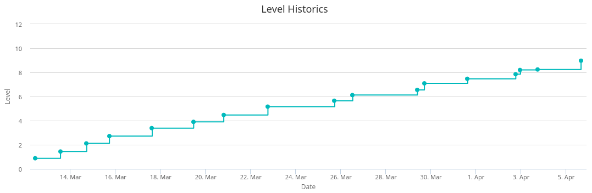
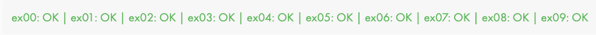
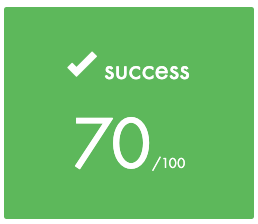
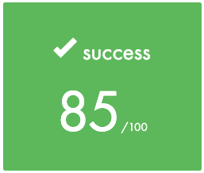
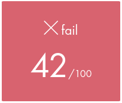
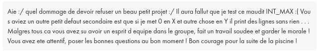
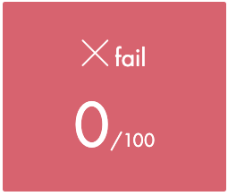
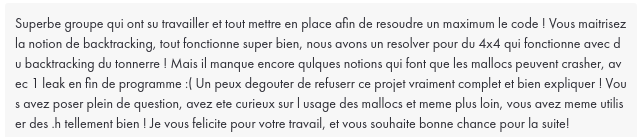
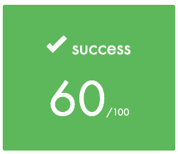

<h1 align="center">Piscine 42</h1>

Épreuve de sélection de l'école [42 Paris](https://42.fr/) nommée "la Piscine" qui consiste à résoudre de nombreux exercices de programmation en Shell et en language C.

J'ai fini au niveau 8.97.

L'ensemble de ces exercices ont été réalisés durant le mois de mars 2024.

Après un mois d'acharnement, je suis fier d'avoir j'ai finalement été sélectionné pour la rentrée de mai 2024.

Ce dépôt a pour unique but de montrer mon évolution en programmation et de garder une trace personnelle durant tous mon cursus et au-delà.

<h3 align="center">⚠️ Clause de non-responsabilité ⚠️</h1>

Si vous êtes entrain de passer la Piscine et qu'il vous viendrait à l'idée de copier mes réponses, sachez que vous avez de fortes chances de vous faire **arracher la tête** par le Bocal de votre campus et de ne pas être séléctionné.

---

### [Shell 00](./shell00/)
Voici le [sujet](./shell00/fr.subject.pdf).

Début de la piscine par du Shell !

Quelques difficultés car c'est une toute nouvelle façon d'appréhender sa machine. Finalement, on se fait la main assez vite !!!
| |
| --- |
|  |

| | |
| --- | --- |
| Moulinette |  |

---
 
### [Shell 01](./shell01/)
Voici le [sujet](./shell01/fr.subject.pdf).

Pas le favori de mes days, je l'ai trouvé assez peu utile au vu des exercices demandés là où Shell00 m'a semblé très pragmatique. Au début de piscine, les 2 premiers jours sont consacrés uniquement à du Shell, si vous voulez commencer le C avant le 3ème jour, vous devez passer Shell00 et Shell01. Je me suis donc lancé malgré ma non-motivation dans ce day.

| |
| --- |
|  |

| | |
| --- | --- |
| Moulinette |  |

--- 

### [C 00](./c00/)
Voici le [sujet](./c00/fr.subject.pdf/).

Enfin du C !!! Les premiers exercices sont assez simples, les choses commencent à se corser à partir de `ft_print_comb`. `ft_putnbr` va être assez compliqué à ce stade car nous n'avons encore jamais vu les récursives mais il est plus qu'important de bien comprendre cet exercie qui reviendra par la suite. J'ai dans un premier temps mis de côté `ft_print_combn` car trop complexe en début de piscine mais je suis revenu dessus à la fin pour valider C00 à 100% !

| |
| --- |
|  |

| | |
| --- | --- |
| Moulinette |  |

--- 

### [C 01](./c01/)
Voici le [sujet](./c00/fr.subject.pdf/).

Introduction des pointeurs ! Quel calvaire au départ, les premiers exercices semblent très simples, mais ce qui est réellement compliqué est de bien comprendre ce qui se passe sur votre machine et ce que font réellement les pointeurs. C01 aura été le day où j'ai passé le plus de temps mais je pense qu'il est plus que nécessaire de passer beaucoup de temps dessus afin de bien assimiler cette notion clé du language C.

| |
| --- |
|  |

| | |
| --- | --- |
| Moulinette |  |

--- 

### [C 02](./c02/)
Voici le [sujet](./c02/fr.subject.pdf/).

Une des grosse difficulté de ce day est de faire la différence entre `ft_strcpy`, `ft_strncpy` et `ft_strlcpy`, puis de l'expliquer à tous ceux qui en avaient besoin.

Je n'ai pas fait `ft_print_memory` même si ce dernier est utile pour la suite.

| |
| --- |
|  |

| | |
| --- | --- |
| Moulinette |  |

--- 

### [C 03](./c03/)
Voici le [sujet](./c03/fr.subject.pdf/).

Traitement de chaines de caractères principalement.

Pas de difficulté majeure sauf peut-être `ft_strstr` mais se résout avec un peu de réflexion. Si vous cherchez une petite astuce pour résoudre ce problème je vous conseille de mettre "raraspoutine" dans votre chaine de caractères "to_find" et de vérifier ce que cela vous sort lorsque que votre chaine de caractère principal reçoit :"cbzuvcobdcbzcd rararaspoutine d evduzvudz". Comprendra qui pourra !

| |
| --- |
|  |

| | |
| --- | --- |
| Moulinette |  |

--- 

### [C 04](./c04/)
Voici le [sujet](./c04/fr.subject.pdf/).

Les 3 premiers exercices sont des fonctions que nous avons déjà codées et qui devienne donc des formalités. Et vient enfin le fameux `ft_atoi`, qui fait peur à tant de monde ! Au final une fois la logique percée à jour rien de bien compliqué, la suite est plus coriace...

`ft_putnbr_base` a été pour moi un casse-tête assez compliqué mais une fois réalisé je me suis rendu compte qu'il serait maintenant faisable le `ft_print_memory` du C02, malheureusement le temps m'a manqué pour le tenter.

J'ai fait `ft_atoi_base` et il a été validé par mes correcteurs même si la moulinette ne la pas validé. Je n'ai pas pris le temps pendant la piscine de chercher mon erreur chose que je ferai durant mon cursus.

| |
| --- |
|  |

| | |
| --- | --- |
| Moulinette |  |

--- 

### [C 05](./c05/)
Voici le [sujet](./c05/fr.subject.pdf/).

Un peu de mathématiques dans ce day, que j'ai beaucoup aimé. Pour la première fois lors d'un passage à la moulinette je vois un refus de sa part avec comme justification "Time out". C'est la première fois et ce grâce à `ft_fibonacci`, `ft_is_prime` et `ft_find_next_prime` que je comprends l'intérêt d'optimiser mon code.

Ce day est souvent sauté par les piscineux alors même qu'il est très utile. Le monstre final de ce day s'appelle les 10 dames. Un exercice que je n'aurais jamais pensé réussir à la base mais après l'apprentissage du rush01 celui-ci me semblait possible. Et c'est la première fois de la piscine que je me suis lancé le défi de réussir à tous pris un exercice auquel je suis finalement venu à bout.

| |
| --- |
|  |

| | |
| --- | --- |
| Moulinette |  |

--- 

### [C 06](./c06/)
Voici le [sujet](./c06/fr.subject.pdf/).

Introduction aux paramètres, et c'est ici que beaucoup de choses prennent plus de sens ! Ce day fait beaucoup de bien au moral car assez facile et rapide si les days précédents ont été fait sérieusement.

| |
| --- |
|  |

| | |
| --- | --- |
| Moulinette |  |

--- 

### [C 07](./c07/)
Voici le [sujet](./c07/fr.subject.pdf/).

Introduction à `malloc`, ce même `malloc` qui nous coûtent à mon groupe de rush01 et moi du 100/100. 

Au final `malloc` va nous en apprendre beaucoup sur l'allocation de mémoire et sur ce qui se passe de façon plus concrète dans notre machine.

`ft_convert_base` fut un casse-tête monstre mais qui m'a montré que je serai effectievement refaire `ft_atoi_base`. `ft_split` était très difficile à ce moment de la piscine, mais j'ai écouté les conseils qui me disaient de prendre le temps de le comprendre et d'en venir à bout car cela allait mettre utile pour l'exam final.

| |
| --- |
|  |

| | |
| --- | --- |
| Moulinette |  |

--- 

### [C 08](./c08/)
Voici le [sujet](./c08/fr.subject.pdf/).

Introduction aux fichiers d'en-tête (header). Et ici beaucoup de choses prennent du sens, qu'est-ce qui peut donc composer ces fichiers .h que l'on introduit en haut de nos codes lorsqu'on veut utiliser des fonctions comme `write`, `malloc` ou `free`.

| |
| --- |
|  |

| | |
| --- | --- |
| Moulinette |  |

--- 

### [C 09](./c09/)
-Voici le [sujet](./c09/fr.subject.pdf/).

Introduction à `Make` et aux fichiers `Makefile` ainsi qu'à la création de librairie.

| |
| --- |
|  |

| | |
| --- | --- |
| Moulinette |  |

--- 

### [Rush 00](./rush00/)
Voici le [sujet](./rush00/fr.subject.pdf/).

Premier rush de la piscine, plutôt simple au premier abord. L'algorithme a été trouvé très rapidement, plusieurs versions du code ont vu le jour pour aboutir à la version finale rendue qui était la plus facile à comprendre au vu de notre niveau de programmation à ce moment-là. Malheureusement l'oublie de la protection sur INT_MAX nous coûtent le 100/100 et même le 125/100 car tous les bonus avaient été réalisés.

| |
| --- |
|  |

| | |
| --- | --- |
| Correcteur 1 |  |

--- 

### [Rush 01](./rush01/)
Voici le [sujet](./rush01/fr.subject.pdf/).

Deuxième rush, le premier semblait faisable et plutôt simple. Celui-ci était une autre paire de manches, il nous aura fallu une demi-journée entière pour enfin commencer à avoir un début de piste. Au final, nous faisons partie des rares groupes à avoir sortie un code fonctionnel répondant au sujet. Malheureusement tous nos mallocs n'ont pas été free, en plus nous avons utilisé une variable globales interdite qui nous coûte notre réussite de peu. c'est donc avec un 0/100 que nous ressortons mais en ayant appris beaucoup.

| |
| --- |
|  |

| | |
| --- | --- |
| Correcteur 1 |  |

--- 

### Exam 00

Je me suis arrêté sur `putstr`, je devais recoder cette fonction mais je ne la maitrisais pas encore et je n'ai pas réussi à la reproduire de la façon attendue. 

| |
| --- |
|  |

### Exam 01

Je m'arrête sur `print_params`, je n'avais malheureusement pas encore vu les arguments du main à ce moment-là de la piscine et je n'ai pas réussi à percer ce mystère durant l'épreuve même si je n'en étais pas loin.

| |
| --- |
|  |

### Exam 02

Je me suis arrêté sur `atoi`, j'ai réussi à reproduire la fonction comme demandé dans les days. Malheureusement je n'ai pas regardé la trace qui m'aurait indiqué que l'`atoi` des days est différent de celui de la fonction normale.

| |
| --- |
|  |

### Exam final

Je m'arrête malheureusement sur `ft_range`, je n'ai pas eu le temps de finir cette fonction que je savais faire. Durant l'épreuve j'ai perdu plus de 4 heures sur `rotone` à cause d'une erreur bête d'inatention de ma part. Au bout du compte, je suis parvenu à m'en défaire et à avancer jusqu'aux 60/100 même si je me sentais capable d'aller plus loin sans cette perte de temps et d'énergie.

| |
| --- |
|  |
